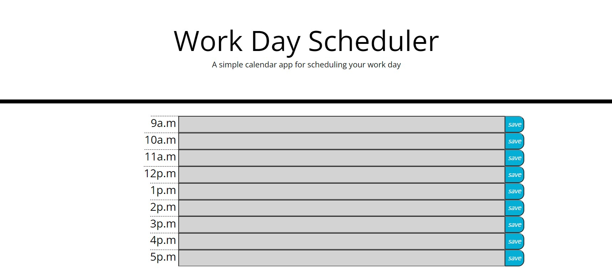

This project was creating a day planner that would store plans after a page refresh. I was provided a basic HTML skeleton and css to start with and had to code the time blocks themselves along with the javascript for the page. To get the time, moment js api was used. Bootstrap and jquery were also used for quick HTML and easier javascript.



The acceptance criteria provided were as follows: 
```md
GIVEN I am using a daily planner to create a schedule
WHEN I open the planner
THEN the current day is displayed at the top of the calendar
WHEN I scroll down
THEN I am presented with timeblocks for standard business hours
WHEN I view the timeblocks for that day
THEN each timeblock is color coded to indicate whether it is in the past, present, or future
WHEN I click into a timeblock
THEN I can enter an event
WHEN I click the save button for that timeblock
THEN the text for that event is saved in local storage
WHEN I refresh the page
THEN the saved events persist
```

Hosted by Github @ https://squid300.github.io/Homework-5-DayPlanner/